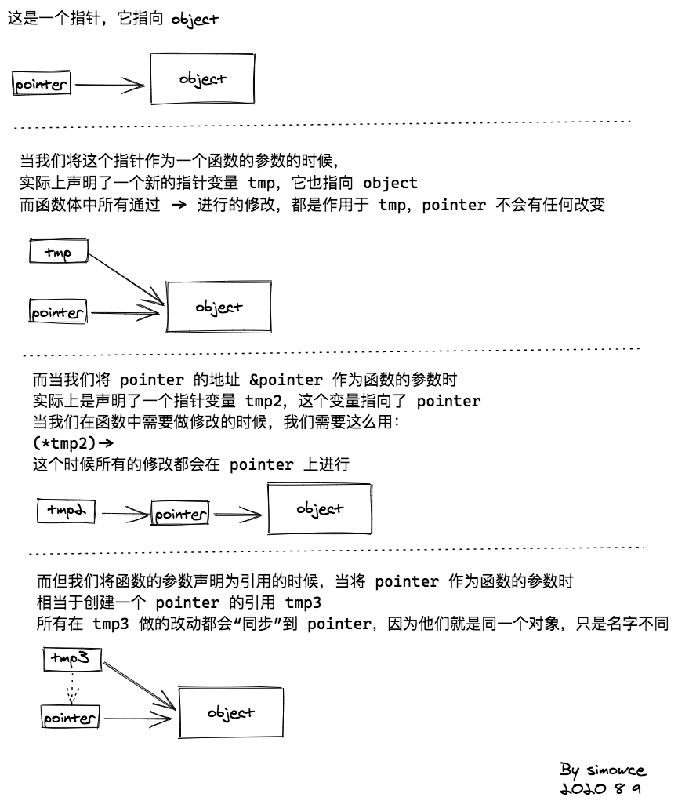
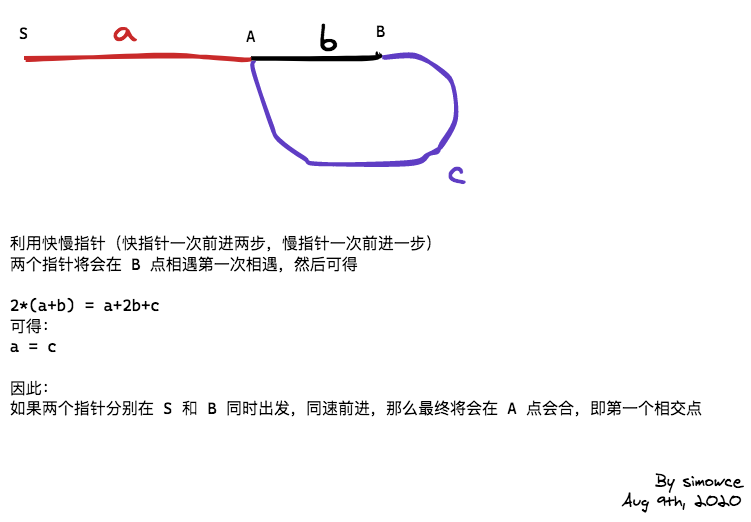

# 链表

1. 反转链表

    迭代的实现非常简单，使用两个指针——`pre` 和 `cur`，`pre` 的初始值是 NULL，`cur` 的初始值是链表头，然后一直往前，缓存 `cur->next` 之后将 `cur->next` 指向 `pre`，然后更新两个指针。退出条件为 `cur == NULL`
  
    递归的方法，有思路，但是就是写不出来，一度开始严重怀疑自己的水平。思路其实非常简单：
    > 递归的目标是找到当前节点 `cur->next` 节点 —— `n`，然后修改 `n->next = cur`
    > 递归的返回结果是自己，这样调用方就可以依照这个返回值修改当前节点的 next 了
    > 递归的结束条件是找到链表的尾结点并且将自己返回。同时因为链表反转了，所以这个尾结点就是最终结果的头结点，因此需要将其保存起来
  
    但是这里面有一个坑，就是因为递归函数的参数是指针，而且函数体**需要修改指针指向的对象的内容**，这就涉及到了函数的传参了。一开始我的答案一直都是 NULL，后面才发现，就是函数传参导致的。
  
    在 C++ 里，函数传参有 3 种：
    * 值传递
    * 指针传递
    * 引用传递
  
    看着挺玄乎的，画个图就清楚了：
  
    
  
    而为什么我一开始的答案一直是 NULL 呢？那是因为参数的默认值就是 NULL，而我是直接值传递的，所有的修改都不会作用于真实的变量。修改为指针或者是引用即可。

    ```cpp
    /**
     * Definition for singly-linked list.
     * struct ListNode {
     *     int val;
     *     ListNode *next;
     *     ListNode(int x) : val(x), next(NULL) {}
     * };
     */
     // 迭代版本
    class Solution {
    public:
        ListNode* reverseList(ListNode* head) {
            ListNode *pre = NULL, *cur = head;

            while (cur) {
                ListNode *n = cur->next;
                cur->next = pre;
                pre = cur;
                cur = n;
            }

            return pre;
        }
    };

    // 递归引用
    class Solution {
    public:
        ListNode*& solve(ListNode *&cur, ListNode *&head) {
            if (!cur->next) {
                head = cur;
                return cur;
            }
            ListNode *next = solve(cur->next, head);
            next->next = cur;
            return cur;
        }
        ListNode* reverseList(ListNode* head) {
            if (!head)
                return head;

            ListNode *ans = NULL;
            solve(head, ans);
            head->next = NULL;

            return ans;
        }
    };

    // 递归指针版本
    class Solution {
    public:
        ListNode** solve(ListNode **cur, ListNode **head) {
            if (!(*cur)->next) {
                *head = *cur;
                return cur;
            }
            (*solve(&(*cur)->next, head))->next = (*cur);
            return cur;
        }
        ListNode* reverseList(ListNode* head) {
            if (!head)
                return head;

            ListNode *ans = NULL;
            solve(&head, &ans);
            head->next = NULL;

            return ans;
        }
    };
    ```

2. 环形链表
    两种题型，是否成环，以及找到第一个环的节点

    首先，假设有两个指针，一个快一个慢，假设链表有环，那么他们一定会相遇的。
    为什么？

    

    ```cpp
    /**
     * Definition for singly-linked list.
     * struct ListNode {
     *     int val;
     *     ListNode *next;
     *     ListNode(int x) : val(x), next(NULL) {}
     * };
     */
    class Solution {
    public:
        bool hasCycle(ListNode *head) {
            if (!head)
                return false;

            ListNode *slow = head, *fast = head->next;

            while (fast) {
                fast = fast->next;
                if (fast)
                    fast = fast->next;
                slow = slow->next;
                if (fast && slow && fast->val == slow->val)
                    return true;
            }
            return false;
        }
    };
    ```

    ```cpp
    class Solution {
    public:
        ListNode *detectCycle(ListNode *head) {
            if (!head)
                return NULL;
            ListNode *slow = head, *fast = head->next;

            while (fast) {
                fast = fast->next;
                if (fast)
                    fast = fast->next;
                slow = slow->next;
                if (fast && slow && fast == slow)
                    break;
            }
            if (!fast)
                return NULL;
            slow = head;
            fast = fast->next;
            while (slow != fast) {
                slow = slow->next;
                fast = fast->next;
            }

            return slow;
        }
    };
    ```

3. 相交链表
    思路：假设两个链表等长，那么我们就可以 one by one 的一个一个比，找到第一个一样的节点即可。但是问题是两个链表长度不一定相等。
    解决方法是：**将两个链表变得长度一样**，为此我们需要遍历两个链表，计算两个链表的长度，然后砍掉长度长的部分，这样就能保证两个链表长度一致。
    那**会不会将一样的节点也给砍掉**？不会，因为：

    * 假设两个链表相交，那么**最大也只能相交短的链表的那部分**，多出的部分是不可能相交的
    * 假设两个链表不相交，那么无论砍掉多出的部分也不会影响结果

    综上，砍掉多出节点的操作不会影响到结果。

    接下来只需要 one by one 比较即可

    ```cpp
    /**
    * Definition for singly-linked list.
    * struct ListNode {
    *     int val;
    *     ListNode *next;
    *     ListNode(int x) : val(x), next(NULL) {}
    * };
    */
    class Solution {
    public:
        ListNode *getIntersectionNode(ListNode *headA, ListNode *headB) {
            int n1 = 0, n2 = 0;
            ListNode *p1 = headA, *p2 = headB;

            while (p1 || p2) {
                p1 = p1 ? n1++, p1->next : NULL;
                p2 = p2 ? n2++, p2->next : NULL;
            }
            p1 = headA, p2 = headB;
            if (n1 > n2) {
                for (int i=0; i<n1-n2; i++)
                    p1 = p1->next;
            } else if (n2 > n1) {
                for (int i=0; i<n2-n1; i++)
                    p2 = p2->next;
            }
            while (p1 != p2) {
                p1 = p1->next;
                p2 = p2->next;
            }
            return p1 == p2 ? p1 : NULL;
        }
    };
    ```
